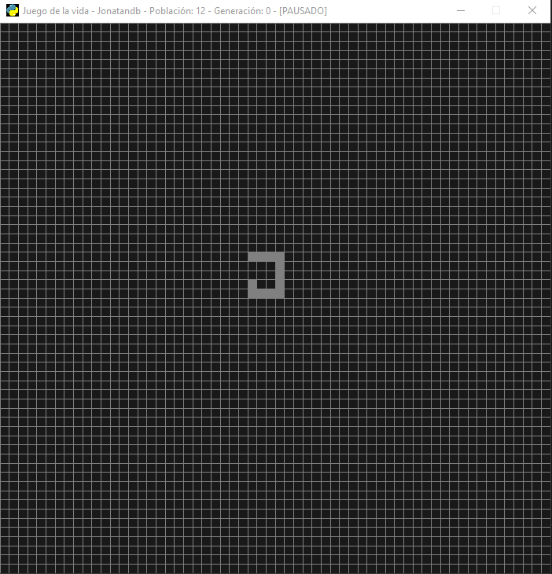

# "Programando el Juego de La Vida... en 10 MINUTOS!"
Inspirada en la versión del autor del canal de Youtube -> DotCSV (Video de referencia [acá](https://www.youtube.com/watch?v=qPtKv9fSHZY))

---
>
# Mi versión online 👉🏻[click acá](https://replit.com/@Jonatandb/DotCSV-Juego-de-la-vida?v=1) 
- Require una cuenta gratuita de [Replit](https://replit.com/) para poder ejecutarlo online.
>
## Adelanto:

    

---

## Los criterios para la vida o la muerte de una célula son:

- Una célula muerta con exactamente 3 células vecinas vivas "nace" (es decir, al turno siguiente estará viva).

- Una célula viva con 2 o 3 células vecinas vivas sigue viva, en otro caso muere (por "soledad" o "superpoblación").

## Cómo jugar:

- ### Al abrir el sitio con el juego presionar el botón "Run" para que comience

- ### Click a una celda le da "vida" y si estaba "viva" entonces se la "mata"

- ### Click medio del mouse Pausa / Reanuda el juego

- #### El juego pausado se puede utilizar para crear autómatas :-)

### Jugalo online haciendo click acá:<a href="https://repl.it/@Jonatandb/DotCSV-Juego-de-la-vida" target="_blank"> Juego de la vida by Jonatandb :-)</a>

---

## Páginas consultadas:

### VSCode:

- <a href="https://code.visualstudio.com/docs/python/python-tutorial" target="_blank">Getting Started with Python in VS Code</a>

- <a href="https://marketplace.visualstudio.com/items?itemName=ms-python.python" target="_blank">Python extension for Visual Studio Code
</a>

- Configuro VSCode para que no muestre un alerta erronea sobre pygame

    - <a href="https://stackoverflow.com/questions/50569453/why-does-it-say-that-module-pygame-has-no-init-member" target="_blank">Why does it say that module pygame has no init member?</a>

- Configuro VSCode para que el entorno de debugging por defecto sea el que ejecuta el archivo actual y para que también formatee el código automáticamente usando black, luego de investigar las opciones disponibles (Black, yapf y autopep8) y leer éstas páginas:

    - <a href="https://www.reddit.com/r/Python/comments/8oqy03/blog_a_comparison_of_autopep8_black_and_yapf_code/" target="_blank">Blog: A comparison of autopep8, black, and yapf - Code formatters for Python</a>

- <a href="https://medium.com/3yourmind/auto-formatters-for-python-8925065f9505" target="_blank">Auto formatters for Python 👨‍💻🤖</a>

### Game of life:

- <a href="https://es.wikipedia.org/wiki/Juego_de_la_vida" target="_blank">Wikipedia: Juego de la vida
  </a>

- <a href="https://es.wikipedia.org/wiki/Oscilador_(aut%C3%B3mata_celular)" target="_blank">Oscilador (autómata celular)
  </a>

- <a href="https://www.microsiervos.com/archivo/juegos-y-diversion/conway-juego-de-la-vida.html" target="_blank">John H. Conway hablando del Juego de la vida</a>

### PyGame

- <a href="https://nerdparadise.com/programming/pygame/part1" target="_blank">PyGame Tutorial: Getting Started</a>

- <a href="https://www.w3schools.com/python/python_casting.asp" target="_blank">Python Casting</a>

- <a href="https://www.pygame.org/docs/" target="_blank">Pygame Front Page - Documents</a>

- <a href="https://www.pygame.org/docs/ref/display.html#pygame.display.set_mode" target="_blank">Pygame: pygame.display.set_mode</a>

- <a href="https://repl.it/talk/learn/A-Starter-Guide-to-Pygame/11741" target="_blank">🚀 A Starter Guide to Pygame 📀</a>

- <a href="https://www.pygame.org/docs/ref/display.html#pygame.display.set_caption" target="_blank">Pygame display.set_caption</a>

- <a href="https://www.pygame.org/docs/ref/key.html" target="_blank">pygame.key</a>

### Incrustar el Repl en el readme para que se pueda jugar directo desde Github:

- <a href="https://www.reddit.com/r/Python/comments/5o0bq1/pygame_web_apps/" target="_blank">Pygame web apps?</a>

- <a href="https://stackoverflow.com/questions/8452927/is-it-possible-to-run-pygame-or-pyglet-in-a-browser/55352300#55352300" target="_blank">is it possible to run pygame or pyglet in a browser?</a>

- <a href="https://www.guru99.com/accessing-internet-data-with-python.html#2" target="_blank">How to get HTML file form URL in Python</a>

- <a href="https://pip.pypa.io/en/latest/user_guide/#requirements-files" target="_blank">PIP - Requirements Files</a>

- <a href="https://stackoverflow.com/questions/3496592/conditional-import-of-modules-in-python" target="_blank">Conditional import of modules in Python</a>

- <a href="https://gamedev.stackexchange.com/questions/82448/any-way-to-embed-pygame-in-webpages" target="_blank">Any way to embed Pygame in webpages?</a>

- <a href="https://stackoverflow.com/questions/48402823/embed-openstreetmap-iframe-in-github-markdown" target="_blank">Embed openstreetmap iframe in github markdown</a>

### Generar el ícono programaticamente utilizando SVG para no depender del archivo .ico:

- <a href="https://www.pygame.org/docs/ref/image.html#comment_pygame_image_load" target="_blank">Pygame.org - pygame.image.load()</a>

- <a href="https://pypi.org/project/drawSvg/" target="_blank">drawSvg - A Python 3 library for programmatically generating SVG images </a>

- <a href="https://www.python.org/community/logos/" target="_blank">The Python Logo
  </a>

- <a href="https://www.w3schools.com/python/python_functions.asp" target="_blank">Python Functions
  </a>

- <a href="https://stackoverflow.com/questions/120584/svg-rendering-in-a-pygame-application" target="_blank">SVG rendering in a PyGame application</a>

- <a href="https://www.guru99.com/python-check-if-file-exists.html" target="_blank">Python Check If File or Directory Exists</a>

### Hacer que funcione clonar el repositorio desde Repl.it y que el juego se inicie correctamente al presionar Run:

- <a href="https://docs.repl.it/repls/dot-replit" target="_blank">Configuring the run button</a>

- <a href="https://blog.repl.it/github" target="_blank">Repl from Repo</a>

- <a href="https://repl.it/talk/learn/Configuring-GitHub-repos-to-run-on-Replit-and-contributing-back/23948" target="_blank">Configuring GitHub repos to run on Repl.it and contributing back</a>

### Python:

- <a href="https://www.programiz.com/python-programming/string-interpolation" target="_blank">Python String Interpolation</a>

- <a href="https://stackoverflow.com/questions/2632677/python-integer-incrementing-with" target="_blank">Python integer incrementing with ++</a>

### Búsquedas varias:

- <a href="https://www.microsoft.com/en-us/microsoft-365/blog/2007/11/02/iteration-conways-game-of-life/" target="_blank">Iteration & Conway’s Game of Life</a>

---

    

